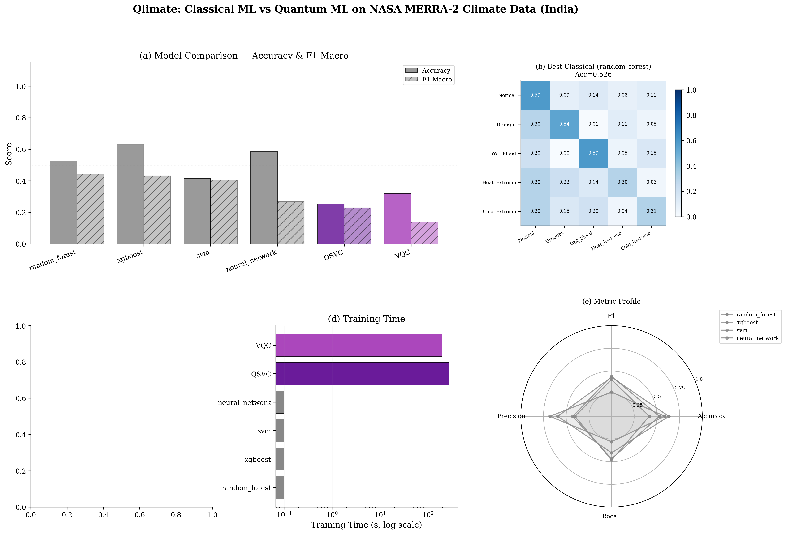
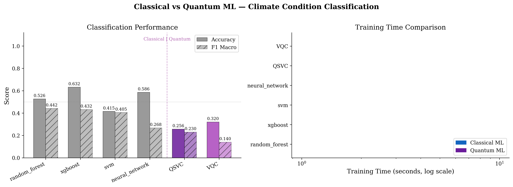
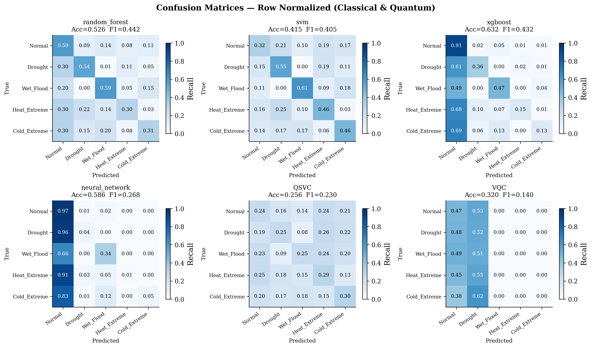
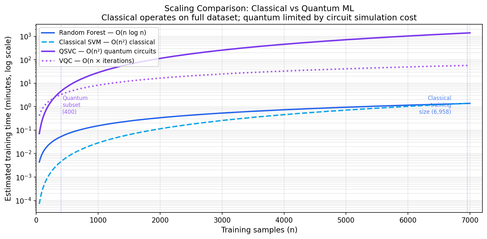
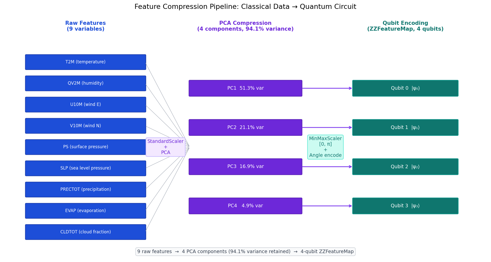
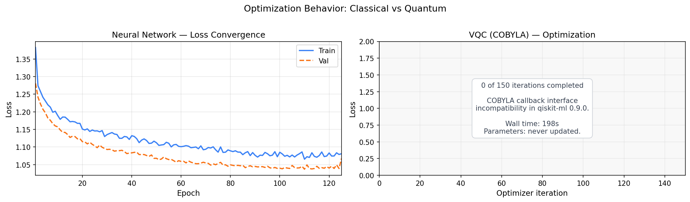
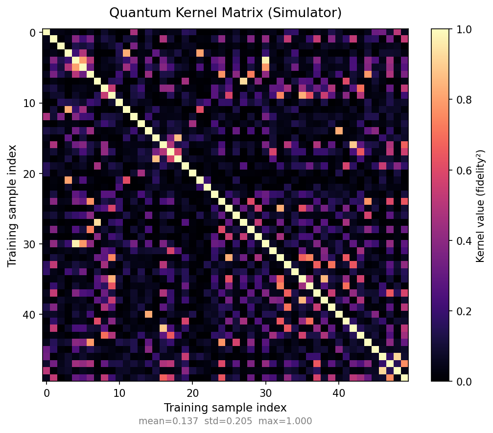
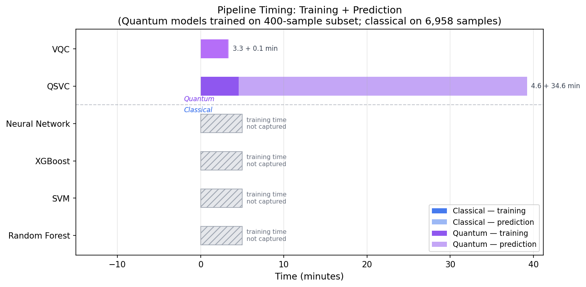

# Qlimate

A comparative systems study of Classical ML and Quantum ML on 30 years of NASA MERRA-2 climate data across Indian states.

> **This project compares computational regimes, not just performance.**
> Same climate problem. Fundamentally different computation.



---

## What This Project Shows

Classical and quantum ML are not competing on equal terms — and that asymmetry is the point:

| Dimension | Classical ML | Quantum ML |
|---|---|---|
| Training samples | 6,958 | 400 (simulation limit) |
| Feature count | 9 | 4 (PCA compressed) |
| Training time | seconds–minutes (not profiled) | 46 min (QSVC), 3 min (VQC) |
| Computational complexity | O(n log n) to O(n²) | O(n²) quantum circuits |
| Hardware | CPU/GPU workstation | IBM ibm_fez (127-qubit Eagle r3) |
| Data compression required | None | 9→4 features, 6,958→400 samples |

The quantum model is not losing — it is operating under fundamentally different constraints imposed by current NISQ hardware and circuit simulation cost.

---

## Interactive Frontend

```bash
cd frontend
npm install
npm run dev
```

Open [http://localhost:5173](http://localhost:5173) — 8 interactive sections:

1. **Overview** — dataset stats, regime comparison
2. **Comparison Dashboard** — side-by-side metrics table and bar chart
3. **Scaling Simulator** — drag slider to see QSVC O(n²) vs classical O(n log n)
4. **Feature Compression** — 9 raw features → 4 PCA dims → 4 qubits
5. **Kernel Matrix Explorer** — simulator heatmap + IBM hardware partial run
6. **Optimization Behavior** — NN loss curves + VQC convergence (honest: 0 iterations)
7. **Pipeline Breakdown** — timing per stage per model
8. **Key Insights** — NISQ constraints, quantum advantage hypothesis

---

## Results



| Model | Type | Accuracy | F1 Macro | Precision | Recall | Training samples |
|---|---|---|---|---|---|---|
| XGBoost | Classical | 0.632 | 0.432 | 0.593 | 0.402 | 6,958 |
| Neural Network | Classical | 0.586 | 0.268 | 0.461 | 0.309 | 6,958 |
| Random Forest | Classical | 0.526 | 0.442 | 0.575 | 0.432 | 6,958 |
| SVM | Classical | 0.415 | 0.405 | 0.479 | 0.399 | 6,958 |
| VQC | Quantum | 0.320 | 0.140 | 0.160 | 0.237 | 400 |
| QSVC | Quantum | 0.253 | 0.230 | 0.285 | 0.241 | 400 |



---

## Computational Differences

### Scaling behavior



- **Classical RF/XGBoost**: near-linear in n — can train on full 6,958-sample dataset
- **QSVC**: O(n²) quantum kernel circuits — 160,000 circuit evaluations at n=400 (46 min)
- **QSVC at classical training size**: extrapolated ~82 hours (computationally infeasible)

### Feature compression pipeline



9 raw variables → StandardScaler + PCA → 4 components (94.1% variance) → MinMaxScaler [0, π] → ZZFeatureMap angle encoding

### Optimization behavior



- **Neural Network**: smooth convergence over 125 epochs (Adam, early stopping)
- **VQC**: 0 optimizer iterations completed — COBYLA callback incompatibility in qiskit-machine-learning 0.9.0. Shown honestly, not hidden.

### Kernel matrix



Simulator kernel values: mean=0.16, max=0.92. Hardware (ibm_fez) expected to compress this range to [0.3, 0.7] due to depolarizing noise.

### Pipeline timing



---

## IBM Quantum Hardware Run

```
Backend:    ibm_fez — 127 qubits, Eagle r3
Circuit:    ZZFeatureMap (4 qubits, reps=1, linear entanglement)
            Transpiled to ISA native gate set (optimization_level=1)
Rows run:   2 / 20 planned kernel rows
Time/row:   ~8–10 min quantum compute
Outcome:    Monthly quota (10 min/month) exhausted after 2 rows
```

Circuits were transpiled, accepted, and executed on real superconducting qubits. Quantum noise flattens the kernel matrix, reducing discriminative power compared to statevector simulation.

---

## Dataset

**Source:** NASA MERRA-2 Monthly Reanalysis (GES DISC / Earthdata)

| Property | Value |
|---|---|
| Collections | M2TMNXSLV · M2TMNXFLX · M2TMNXRAD |
| Variables | T2M, QV2M, U10M, V10M, PS, SLP, PRECTOT, EVAP, CLDTOT |
| Coverage | 1995–2024 (355 months) · 28 Indian states |
| Total rows | 9,940 (355 months × 28 states) |
| Split | 70 / 15 / 15 (train / val / test, stratified) |

**5-class labels** (per state, per calendar month — accounts for seasonality):

| Class | Condition |
|---|---|
| Heat Extreme | T2M > 90th percentile |
| Cold Extreme | T2M < 10th percentile |
| Drought | PRECTOT < 15th percentile |
| Wet / Flood | PRECTOT > 85th percentile |
| Normal | none of the above |

---

## Setup

```bash
git clone <repo-url>
cd Qlimate
pip install -r requirements.txt
```

### Credentials

```bash
export EARTHDATA_PASSWORD="your_password"      # Required for data download
export IBM_CLOUD_API_KEY="your_key"            # Optional: IBM Quantum hardware
```

Update `config/config.yaml` with your Earthdata username and IBM Cloud CRN.

---

## Running the Pipeline

```bash
# Full pipeline (after data download)
python run.py

# Key stages
python run.py --only classical        # Train RF, SVM, XGBoost, NN
python run.py --only quantum          # Train QSVC, VQC (~1 hour)
python run.py --only evaluate         # Compare all models
python run.py --only visualize        # Standard figures + dashboard
python run.py --only export_metrics   # Export JSON for frontend
python run.py --only visualize_extended  # Extended analysis figures

# Resume from a stage
python run.py --from evaluate
python run.py --from export_metrics
```

### Download MERRA-2 data

```bash
python src/data/download.py
```

~3.5 GB, 1,080 NetCDF4 files. Resumes from where it left off.

### Export metrics JSON

```bash
python scripts/export_metrics.py
```

Writes `results/metrics/*.json` and copies to `frontend/src/data/` if the frontend exists.

---

## Project Structure

```
Qlimate/
├── config/config.yaml              # All hyperparameters and paths
├── run.py                          # Pipeline orchestrator
├── scripts/
│   └── export_metrics.py           # Export all metrics to JSON
├── src/
│   ├── data/
│   │   ├── download.py             # MERRA-2 Earthdata download
│   │   ├── preprocess.py           # Grid-to-state aggregation
│   │   └── label.py                # Climate condition labeling
│   ├── features/
│   │   └── engineering.py          # Feature engineering, splits, PCA
│   ├── models/
│   │   ├── classical.py            # RF, SVM, XGBoost, PyTorch NN
│   │   └── quantum.py              # QSVC, VQC, IBM hardware runner
│   ├── evaluation/
│   │   └── metrics.py              # Unified evaluation metrics
│   └── visualization/
│       ├── static_plots.py         # Original comparison figures
│       ├── interactive.py          # Plotly dashboard
│       ├── kernel_visualization.py # Kernel matrix heatmap
│       ├── optimization_plots.py   # NN + VQC convergence plots
│       ├── scaling_plots.py        # Classical vs quantum scaling
│       ├── feature_flow.py         # Feature compression diagram
│       └── pipeline_breakdown.py   # Per-stage timing chart
├── frontend/                       # React interactive dashboard
│   ├── src/
│   │   ├── data/                   # JSON from results/metrics/
│   │   ├── components/
│   │   │   ├── charts/             # Plotly chart components
│   │   │   ├── sections/           # Page sections
│   │   │   └── layout/             # Navbar, wrappers
│   │   └── App.jsx
│   └── package.json
├── results/
│   ├── figures/                    # All PNG figures
│   ├── models/                     # Saved model artifacts
│   ├── metrics/                    # JSON metric exports
│   ├── model_comparison.csv
│   └── dashboard.html
└── data/
    ├── raw/                        # MERRA-2 NetCDF4 (gitignored)
    └── processed/                  # State CSVs (gitignored)
```

---

## Acknowledgements

- **Dataset:** [NASA MERRA-2](https://gmao.gsfc.nasa.gov/reanalysis/MERRA-2/) via GES DISC / Earthdata
- **Quantum framework:** [Qiskit](https://www.ibm.com/quantum/qiskit) by IBM
- **India boundaries:** [Subhash9325/GeoJson-Data-of-Indian-States](https://github.com/Subhash9325/GeoJson-Data-of-Indian-States)
